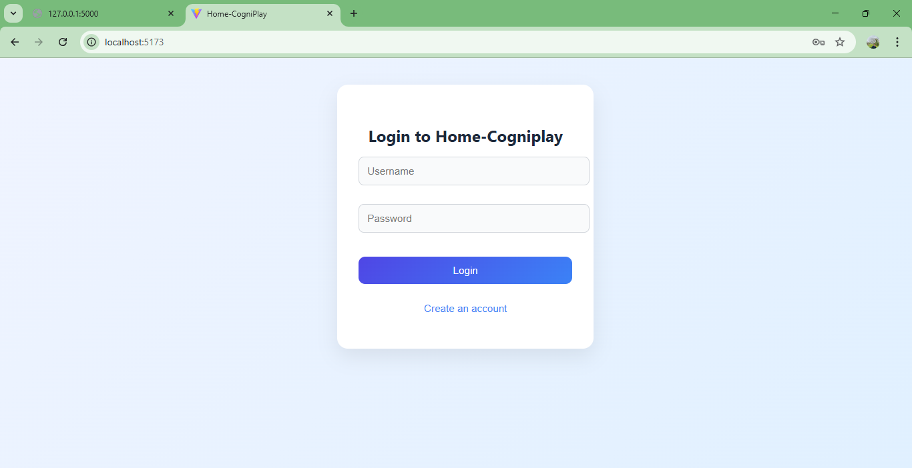

🧠 Home-Cogniplay  
*Computerized Cognitive Retraining Program for Home-Training of Children with Disabilities*

Home-Cogniplay is a modern web-based cognitive training platform designed to help children improve **memory, attention, focus, and reaction skills** through scientifically inspired games.  
It includes a **Parent/Student dashboard**, **Therapist dashboard**, and **complete session tracking**.

---

## 🚀 Features

### 🎮 Cognitive Games
#### **Memory Game**
- Match similar fruit cards  
- Improves visual memory and recall  
- Difficulty increases number of card pairs  

#### **Attention Game**
- Identify the odd-colored block  
- Improves attention, reaction time, and focus  
- Difficulty increases grid size  

---

## 👨‍🏫 Therapist Dashboard  
- View performance of all users  
- Analyze:
  - Average mistakes  
  - Improvement trend  
  - Recent sessions  
- View complete session history in a structured table  

---

## 👪 Parent / Student Dashboard
- Choose a game  
- Select difficulty  
- Play games and receive **performance feedback**  
- Review personal session history  

---

## 📨 Feedback System
- Users can submit in-app feedback  
- Feedback stored locally in browser  
- Optional email support  
  - Sends feedback to **manojkurubhas0622@gmail.com**

---

## 📁 Project Structure

cognitive-project/
│── backend/ # Flask backend (API, auth, session DB)


│── frontend/


│ ├── public/


│ ├── src/

│ │ ├── App.jsx

│ │ ├── Auth.jsx

│ │ ├── MemoryGame.jsx

│ │ ├── AttentionGame.jsx

│ │ ├── Sessions.jsx

│ │ ├── Feedback.jsx

│ │ ├── TherapistDashboard.jsx

│ │ ├── api.js

│ │ └── index.css

│ ├── package.json

│ └── vite.config.js


│── .gitignore


│── README.md


│── LICENSE


## 🛠️ Tech Stack

### **Frontend**
- React (Vite)
- Custom CSS Styling
- LocalStorage (auth + feedback)

### **Backend**
- Flask (Python)
- JWT Authentication
- SQLite / Any SQL DB for storing sessions

---

## 📦 Installation & Running

### 🔧 Backend
```bash
cd backend
pip install -r requirements.txt
python app.py

Backend runs at:
📌 http://127.0.0.1:5000

🖥️ Frontend
cd frontend
npm install
npm run dev


Frontend runs at:
📌 http://localhost:5173

📊 Game Logic Overview
🧩 Memory Game

Randomized cards each round

Score increases when pairs match

Mistakes counted on mismatches

End-of-game summary shows:

⏱️ Time taken

✔️ Correct pairs

⭐ Performance summary

🎯 Attention Game

Find the odd-colored block

Grid scales with difficulty

Tracks:

✔️ Correct selections

❌ Mistakes

⏱️ Average reaction time

Summary shown after finishing

💾 Data Storage
Backend

Stores all session history

Used for therapist analysis

Frontend

Feedback is saved locally

Auth token stored in LocalStorage

🖼️ Application Screenshots (Grid View)
🔐 Login & 🎮 Game Menu
Login Screen	Game Menu
	
🍎 Memory Game & 🎨 Attention Game
Memory Game	Attention Game
	
📊 Sessions Dashboard
Sessions History

📬 Contact

For queries, improvements, or collaborations:
📧 manojkurubhas0622@gmail.com

📄 License
This project uses the MIT License \
