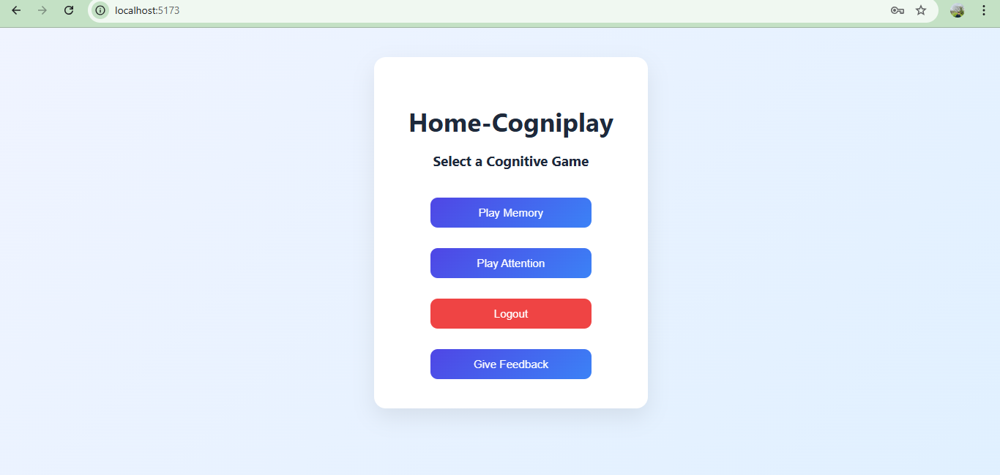
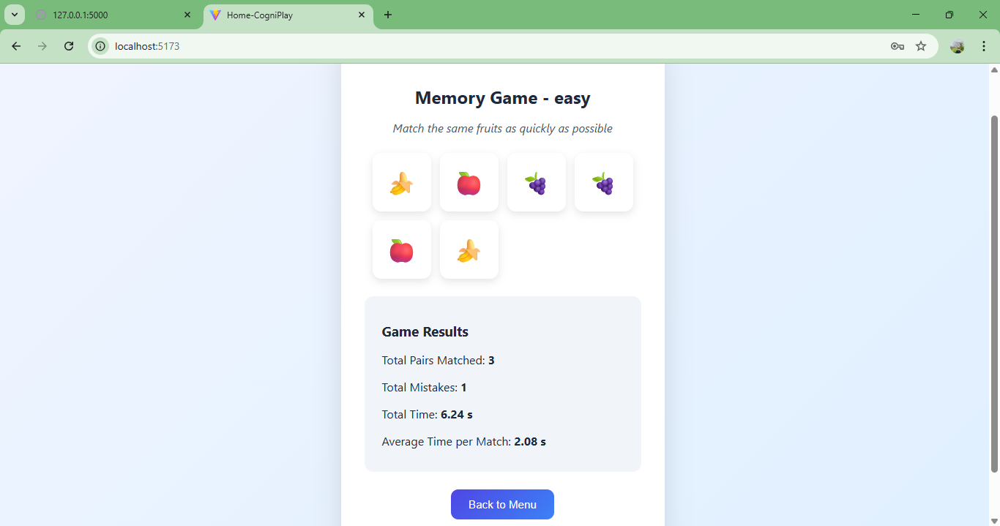
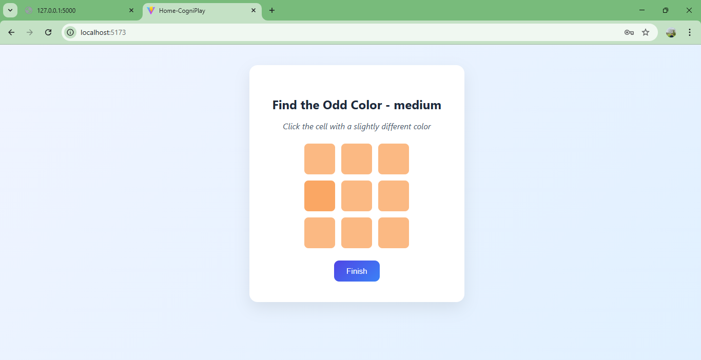
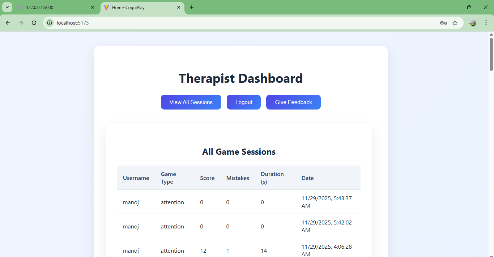

🧠 Home-Cogniplay
Computerized Cognitive Retraining Program for Home-Training of Children with Disabilities

Home-Cogniplay is a modern web-based cognitive training platform designed to help children improve their memory, attention, focus, and reaction skills through scientifically inspired games.
It includes a parent/student dashboard, a therapist dashboard, and complete session tracking.

🚀 Features
🎮 Cognitive Games

Memory Game
Improve visual memory by matching pairs of fruits. Difficulty affects number of pairs.

Attention Game
Improve focus by identifying the odd-colored block. Increasing difficulty expands the grid.

👨‍🏫 Therapist Dashboard

View progress of all users

Analyze average mistakes, performance trend, and latest sessions

View all recorded sessions in a filtered table

👪 Parent / Student Dashboard

Choose game

Select difficulty

Play and receive post-game performance feedback

Track personal sessions

📨 Feedback System

Users can submit feedback

View previously saved feedback

Feedback stored locally in browser

Optional email sending support (manojkurubhas0622@gmail.com
)

📁 Project Structure
cognitive-project/
│── backend/                # Flask backend (API, authentication, session storage)
│── frontend/
│     ├── public/
│     ├── src/
│     │     ├── App.jsx
│     │     ├── Auth.jsx
│     │     ├── MemoryGame.jsx
│     │     ├── AttentionGame.jsx
│     │     ├── Sessions.jsx
│     │     ├── Feedback.jsx
│     │     ├── TherapistDashboard.jsx
│     │     ├── api.js
│     │     └── index.css
│     ├── package.json
│     └── vite.config.js
│── .gitignore
│── README.md

🛠️ Tech Stack
Frontend

React (Vite)

CSS (Custom styling)

LocalStorage for feedback and auth persistence

Backend

Flask (Python)

JWT authentication

SQLite / Any SQL DB for session storage

📦 Installation & Running
🔧 Backend
cd backend
pip install -r requirements.txt
python app.py

The backend runs at:
http://127.0.0.1:5000

🖥️ Frontend
cd frontend
npm install
npm run dev

The frontend runs at:
http://localhost:5173

📊 Game Logic Overview
Memory Game

Cards are randomized each round

Matching pairs increases score

Wrong selections increase mistake count

End-of-game reward includes:

Total time taken

Number of correct pairs

Performance summary

Attention Game

Identify the odd-colored block

Grid size increases with higher difficulty

Tracks:

Correct detections

Mistakes

Average reaction time per correct selection

Game summary shown after finishing

💾 Data Storage
Backend

Sessions stored in the database

Therapist analysis uses:

mistake patterns

averages

improvement trend

Frontend

Feedback stored locally using localStorage

🖼️ Screenshots 
## 🖼️ Application Screenshots (Grid View)
Below is a quick visual overview of key screens from **Home-Cogniplay**:

### 🔐 Login & 🎮 Game Menu
| Login Screen | Game Menu |
|--------------|-----------|
|  |  |

### 🍎 Memory Game & 🎨 Attention Game
| Memory Game | Attention Game |
|-------------|----------------|
|  |  |

### 📊 Sessions Dashboard

| Sessions History |
|------------------|
|  |

📬 Contact

For queries or improvements:
📧 manojkurubhas0622@gmail.com

📄 License

This project can include an MIT License.
Ask me if you want a pre-written LICENSE file.
